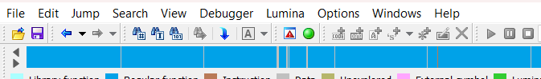
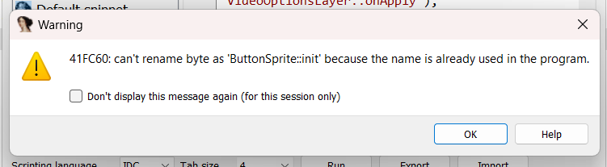

# How to use

First you must download the [script](https://github.com/iArtie/BindingsNamesForIDA/raw/main/scripts.exe) file to be able to use it

You also need to download the file "GeometryDash.bro" or you can use your own for this

## **1. Create a folder**

It is necessary to create a folder and put the necessary files inside it

## **2. Paste the files mentioned above**

Once you paste the files your folder should look like this

## **3. Run the .exe**

If you are following the steps correctly, when you run it it will show you this message, just press enter to close it

## **3,5. Open the file "IDAnames.txt" **

If everything is correct within the same folder, a file called "IDAnames.txt" will be created, simply open it

## **4. Verify file content**

It is very important to see that your file is not empty, otherwise you are doing something wrong! Make sure your file looks something like this:

## **5. Select all content and copy it**

Once the content is good we simply select all the content and copy it, or you can also use:

**ctrl + A** to select all

and

**ctrl + C" to copy the content

## **6. Open the File tab in IDA**

## **7. Select the "Script command" option**

Or you can simply press **Shift + F2**

## **8. Change script language**

By default python may be selected

## **9. Change it to IDC**

Since the copied text is of the "idc" format

## **10. Paste previously copied content**

If you did everything right, it should look like this

## **11. Run the script**

I feel like this step is not necessary, but you never know what questions people may have

(and yes, you just have to hit the run button)

## **12. Warning messages**

If the messages that appear are like this, don't worry, just press ok until they stop appearing

## **13. That's all!**

Now your functions will be named within IDA!

Remember that those that do not have addresses in their "GeometryDash.bro" file will not appear renamed

# Amazin! It would be great if you supported me by giving the repository a star, tysm <3
